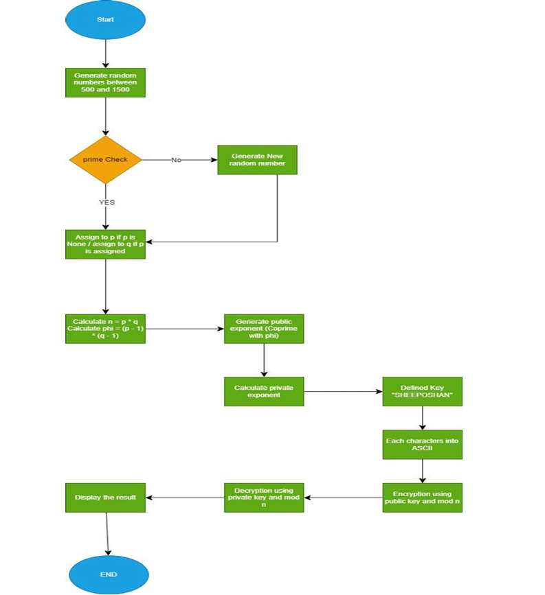
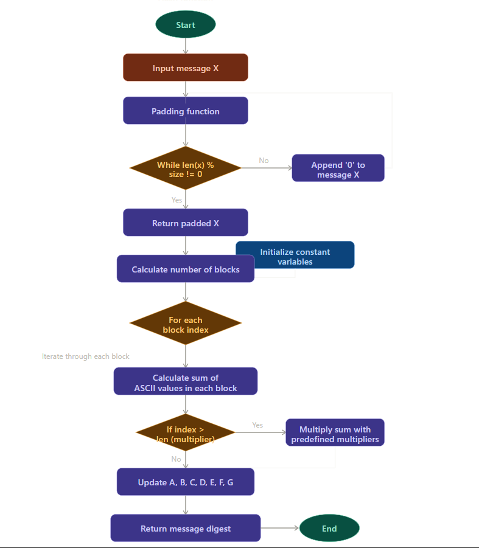
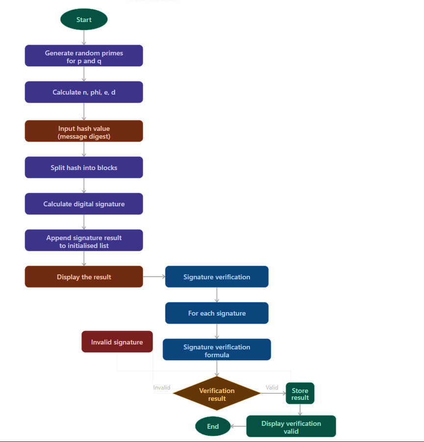

# Cryptographic Concepts Portfolio

A collection of cryptographic algorithms implemented from scratch in Python. This portfolio demonstrates a working hybrid cryptosystem combining symmetric and asymmetric encryption techniques.

---

## Overview

This portfolio implements three core cryptographic components that together form a complete hybrid cryptosystem — the same approach used in real-world secure communication systems like TLS/HTTPS.

| Component | File | Description |
|---|---|---|
| RSA Key Encryption | `rsa-encryption/RSA_Key_Encryption.py` | Encrypts and decrypts a symmetric key using RSA |
| Hash Function | `hash-function/Hash_Function.py` | Custom-designed message digest algorithm |
| Digital Signature | `digital-signature/Digital_Signature.py` | RSA-based digital signature with verification |

---

## Components

### 1. RSA Key Encryption
**File:** `rsa-encryption/RSA_Key_Encryption.py`

Implements RSA public/private key encryption to securely transmit a symmetric cipher key `K = "SHEEPOSHAN"`.

**How it works:**
- Randomly generates two large prime numbers `p` and `q` (range: 500–1500)
- Calculates modulus `n = p * q` and Euler's totient `phi = (p-1) * (q-1)`
- Generates public exponent `e` (co-prime with phi) and private exponent `d` (modular inverse of e)
- Encrypts each character of the key by converting to ASCII and applying `C = M^e mod n`
- Decrypts using `M = C^d mod n`
- Uses a custom **Square and Multiply** algorithm for efficient large exponentiation

**Flowchart:**



---

### 2. Hash Function (Custom Message Digest)
**File:** `hash-function/Hash_Function.py`

A custom-designed hash function that produces a message digest for a given input message.

**Design approach (inspired by SHA-1):**
- Pads the message so its length is divisible by the block size (7 characters)
- Splits the padded message into 7-character blocks
- Converts each character to ASCII and computes a weighted sum per block
- Applies large pre-defined exponential multipliers to each block for complexity
- Updates seven constant variables (A–G) using mixed arithmetic operations (addition, multiplication, XOR)
- Combines all constants to produce the final message digest

**Security properties tested:**
- ✅ Pre-image resistant — computationally infeasible to reverse
- ✅ Second pre-image resistant — no two different inputs produce the same digest
- ✅ Collision resistant — unique output even with minor input changes

**Flowchart:**



---

### 3. Digital Signature
**File:** `digital-signature/Digital_Signature.py`

Implements an RSA-based digital signature scheme using the message digest from the Hash Function component.

**How it works:**
- Uses the message digest as input
- Splits the digest into 6-digit blocks (to ensure each block is smaller than modulus `n`)
- Signs each block using Alice's **private key**: `S = block^d mod n`
- Verifies each signature using Alice's **public key**: `X' = S^e mod n`
- Confirms authenticity if the recomputed digest matches the original

**Key design choice — RSA over MAC:**
RSA digital signatures were chosen over Message Authentication Codes (MACs) because RSA provides **non-repudiation** — the sender cannot deny having signed the message, since the signature is uniquely bound to their private key.

**Flowchart:**



---

## Hybrid Cryptosystem

Together, these three components form a complete hybrid cryptosystem:

```
Alice                                    Bob
  |                                        |
  |-- Symmetric encryption (Portfolio 1) ->|  (Stream/Block cipher encrypts message X)
  |-- RSA encrypts symmetric key K ------->|  (Bob decrypts K using his private key)
  |-- Hash(X) signed with private key ---->|  (Bob verifies signature using public key)
  |                                        |
```

**Why hybrid?**
- **Symmetric encryption** is fast and efficient for encrypting large data
- **Asymmetric encryption (RSA)** securely transfers the symmetric key without exposing it
- **Digital signature** ensures message integrity and authenticity (non-repudiation)

---

## Tech Stack

- **Language:** Python 3
- **Libraries:** `random`, `math` (standard library only — no external dependencies)
- **Algorithms:** RSA, Square and Multiply, Custom Hash Function

---

## How to Run

```bash
# RSA Key Encryption
python rsa-encryption/RSA_Key_Encryption.py

# Hash Function
python hash-function/Hash_Function.py

# Digital Signature
python digital-signature/Digital_Signature.py
```

> Note: RSA components use random prime generation, so output values (p, q, n, keys) will differ on each run. The verification result will always show `Valid: True` for correctly signed blocks.

---

## Project Structure

```
cryptography-portfolio/
├── rsa-encryption/
│   └── RSA_Key_Encryption.py
├── hash-function/
│   └── Hash_Function.py
├── digital-signature/
│   └── Digital_Signature.py
└── flowcharts/
    ├── rsa_flowchart.png
    ├── hash_flowchart.png
    └── digital_signature_flowchart.png
```

---
